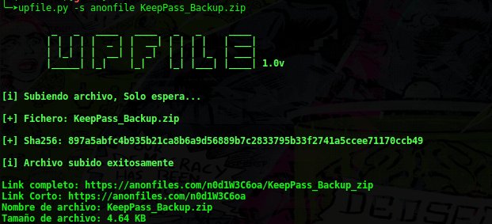

# Upfile - Sube tu fichero desde la terminal
Upfile tiene como funcion subir ficheros a los servidores de **Anonfiles** y **Bayfiles**, todo esto desde la comodidad de tu terminal.

## Lista de Servidores
- Anonfiles
- Bayfiles

## Instalacion de modulos
```
pip install requests
pip install argparse
```

## Uso
El uso de **upfile** es muy sencillo, he aqui los parametros...
```
$ ./upfile.py -s <servidor> <fichero>
```

## Preview



## Contribucion
Si deseas cooperar en el proyecto eres bienvenido de hacerlo,¡adios y buen dia!.
